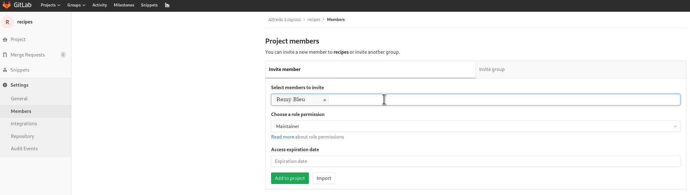

# Collaborating

**Questions**
- *How can I use version control to collaborate with other people?*

**Objectives**
- *Clone a remote repository.*
- *Collaborate pushing to a common repository.*
- *Describe the basic collaborative workflow.*

**Keypoints**
- *`git clone` copies a remote repository to create a local repository with a remote called `origin` automatically set up.*

---

For the next step, get into pairs.  One person will be the "Owner" and the other
will be the "Collaborator". The goal is that the Collaborator add changes into
the Owner's repository. We will switch roles at the end, so both persons will
play Owner and Collaborator.

## Practicing By Yourself

If you're working through this lesson on your own, you can carry on by opening
a second terminal window.
This window will represent your partner, working on another computer. You
won't need to give anyone access on GitLab, because both 'partners' are you.


The Owner needs to give the Collaborator access.
On GitLab, click the settings button on the left bar,
then select Members, and enter your partner's username and give them "Maintainer" permissions.



The Collaborator needs to download a copy of the Owner's repository to her
 machine. This is called "cloning a repo". To clone the Owner's repo into
her `Desktop` folder, the Collaborator enters:

```
$ git clone git@git.automation.ucl.ac.uk:ccealing/recipes.git ~/Desktop/ccealing_recipes
```

Replace 'ccealing' with the Owner's username.


The Collaborator can now make a change in her clone of the Owner's repository,
exactly the same way as we've been doing before:

```shell
$ cd ~/Desktop/ccealing_recipes
$ nano hummus.md
```


```markdown
# Ingredients
- chickpeas
- lemon
- olive oil
- salt
```


```shell
$ git add hummus.md
$ git commit -m "Add ingredients for hummus"
 1 file changed, 5 insertion(+)
 create mode 100644 hummus.md
```

Then push the change to the *Owner's repository* on GitLab:

```shell
$ git push origin master
Counting objects: 4, done.
Delta compression using up to 4 threads.
Compressing objects: 100% (2/2), done.
Writing objects: 100% (3/3), 306 bytes, done.
Total 3 (delta 0), reused 0 (delta 0)
To git.automation.ucl.ac.uk:ccealing/recipes.git
   9272da5..29aba7c  master -> master
```

Note that we didn't have to create a remote called `origin`: Git uses this
name by default when we clone a repository.  (This is why `origin` was a
sensible choice earlier when we were setting up remotes by hand.)

## Some more about remotes

In this episode and the previous one, our local repository has had
a single "remote", called `origin`. A remote is a copy of the repository
that is hosted somewhere else, that we can push to and pull from, and 
there's no reason that you have to work with only one. For example, 
on some large projects you might have your own copy in your own GitLab
account (you'd probably call this `origin`) and also the main "upstream"
project repository (let's call this `upstream` for the sake of examples).
You would pull from `upstream` from time to 
time to get the latest updates that other people have committed.

Remember that the name you give to a remote only exists locally. It's
an alias that you choose - whether `origin`, or `upstream`, or `fred` -
and not something intrinstic to the remote repository.

The `git remote` family of commands is used to set up and alter the remotes
associated with a repository. Here are some of the most useful ones:

* `git remote -v` lists all the remotes that are configured (we already used
this in the last episode)
* `git remote add [name] [url]` is used to add a new remote
* `git remote remove [name]` removes a remote. Note that it doesn't affect the 
remote repository at all - it just removes the link to it from the local repo.
* `git remote set-url [name] [newurl]` changes the URL that is associated 
with the remote. This is useful if it has moved, e.g. to a different GitLab
account, or from GitLab to a different hosting service. Or, if we made a typo when
adding it!
* `git remote rename [oldname] [newname]` changes the local alias by which a remote 
is known - its name. For example, one could use this to change `upstream` to `fred`.


Take a look to the Owner's repository on its GitHub website now (maybe you need
to refresh your browser.) You should be able to see the new commit made by the
Collaborator.

To download the Collaborator's changes from GitLab, the Owner now enters:

```shell
$ git pull origin master
remote: Counting objects: 4, done.
remote: Compressing objects: 100% (2/2), done.
remote: Total 3 (delta 0), reused 3 (delta 0)
Unpacking objects: 100% (3/3), done.
From git.automation.ucl.ac.uk:ccealing/recipes.git
 * branch            master     -> FETCH_HEAD
Updating 9272da5..29aba7c
Fast-forward
 hummus.md | 5 +
 1 file changed, 5 insertion(+)
 create mode 100644 hummus.md
```

Now the three repositories (Owner's local, Collaborator's local, and Owner's on
GitLab) are back in sync.

## A Basic Collaborative Workflow

In practice, it is good to be sure that you have an updated version of the
repository you are collaborating on, so you should `git pull` before making
our changes. The basic collaborative workflow would be:

* update your local repo with `git pull origin master`,
* make your changes and stage them with `git add`,
* commit your changes with `git commit -m`, and
* upload the changes to GitHub with `git push origin master`

It is better to make many commits with smaller changes rather than
of one commit with massive changes: small commits are easier to
read and review.


## Switch Roles and Repeat

Switch roles and repeat the whole process.
